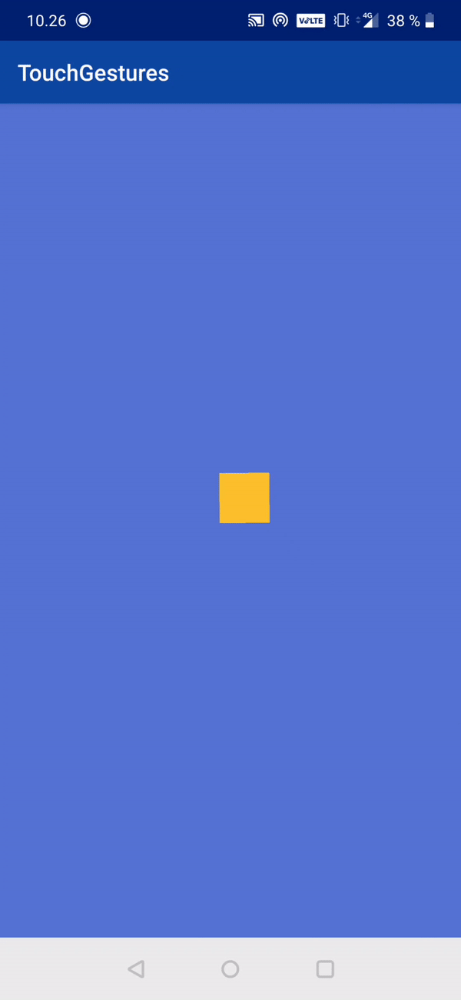
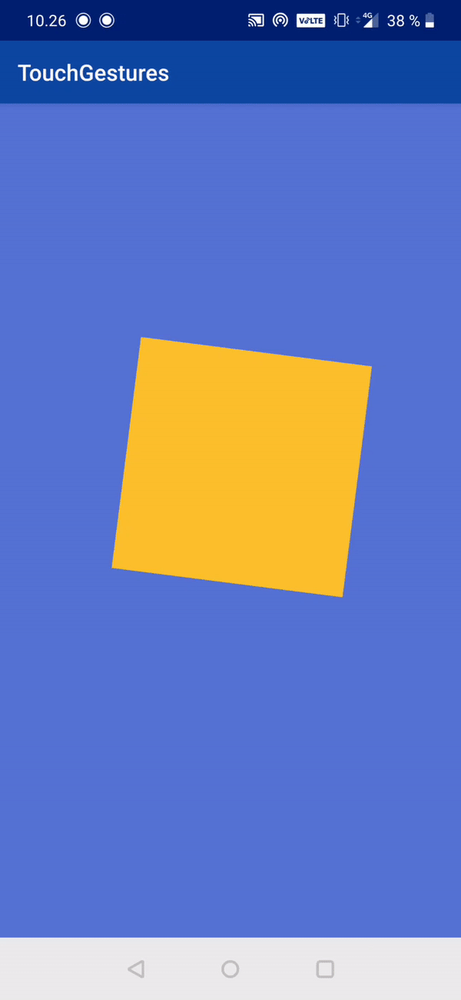
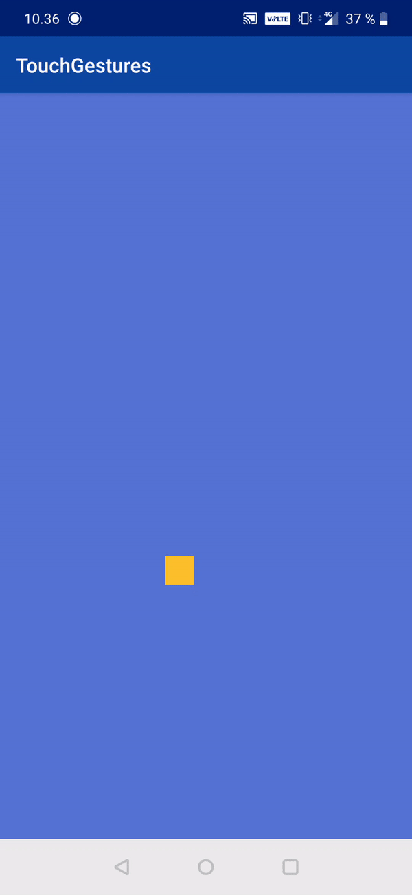

Detect multiple multi-touch gestures such as zoom and rotation with fling.

# Features
- single click
- double click
- long click
- smooth zoom
- smooth rotation
- smooth 2D-scrolling

| Scale/Zoom | Rotation | Move/Translate |
| ---------- | -------- | -------------- |
|   |  |  |

# Usage
```kotlin
class MyView(context: Context): View(context) {
  private val mTouchGestureDetector: TouchGestureDetector = TouchGestureDetector(context, object : TouchGestureDetector.Listener {
    override fun onEnd() {}
    override fun onDoubleClick(x: Float, y: Float) {}
    override fun onClick(detector: TouchGestureDetector, x: Float, y: Float) {}
    override fun onLongClick(x: Float, y: Float) {}
    override fun onMove(detector: TouchGestureDetector, deltaX: Float, deltaY: Float) {}
    override fun onScale(detector: TouchGestureDetector, focusX: Float, focusY: Float, scaleFactor: Float) {}
    override fun onRotate(focusX: Float, focusY: Float, angle: Float) {}
  })

  override fun onTouchEvent(event: MotionEvent): Boolean {
    val ret: Boolean = mTouchGestureDetector.onTouchEvent(event)

    if (ret)
     invalidate()

    return ret
  }

  override fun computeScroll() {
    if (mTouchGestureDetector.computeScroll()) {
      ViewCompat.postInvalidateOnAnimation(this)
    }
  }
}

```
